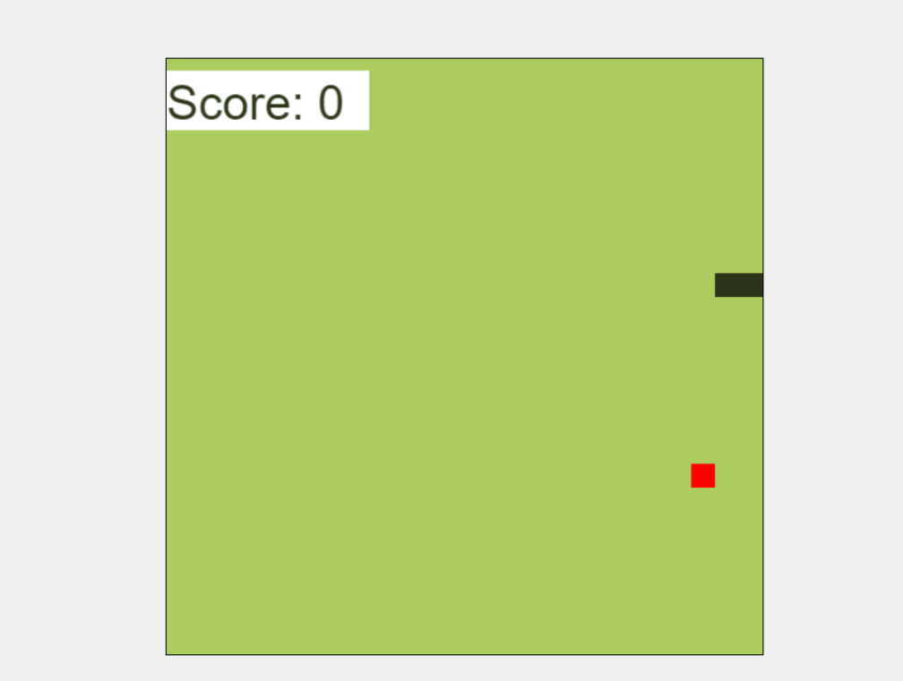

# SnakeGame    

This project is a simple Snake Game built using Flask for the backend and JavaScript for the frontend. The game is deployed using Docker and can be build,tested and deployed using Jenkins Pipeline.


### WebApp



## Setup Instructions

1. **Fork & Clone the repository**
    - Fork the repository  https://github.com/sudhanshuvlog/SnakeGame.git
    - Once you have forked the repo on your github account, Clone the repo in your system
        ```bash
        git clone <your repo URL>
        cd SnakeGame
        ```

2. **Launch Server**

    - Launch an AWS EC2 Instance with `t2.medium` as Instance Type, and Give atleast 15GB of EBS Volume.
    - In `Security Group` you can allow all the trafic.
    - In your Ec2 Instance, Install docker
        ```bash
        yum install docker -y
        systemctl start docker
        ```

3. **Jenkins Setup**:

    - Launch Jenkins Server:

        ```bash
        docker run -p 8080:8080 -p 50000:50000 -dit --name jenkins --restart=on-failure -v jenkins_home:/var/jenkins_home jenkins/jenkins:lts-jdk17
        ```
    
    -  Configure Jenkins Slave Node:
        - Follow this doc to add a agent in Jenkins https://www.jenkins.io/doc/book/using/using-agents/
        - On your Jenkins slave node, install JDK 17(You can make your base Ec2 Instance as slave node):
        
            ```bash
            wget https://download.oracle.com/java/17/archive/jdk-17.0.10_linux-x64_bin.rpm
            yum install jdk-17.0.10_linux-x64_bin.rpm -y
            ```

        - Start the agent and join it to the Jenkins Master Node using the provided join command.


4. **Continuous Integration & Deployment**

    - The `Jenkinsfile` is used to automate the process of testing, building, and deploying the Snake Game using Jenkins.
    - Detailed overview of Jenkinsfile is given below

5. **Access the game:**

    - Open your web browser and navigate to http://< Ec2 Public IP >:5000 to play the Snake Game.


### Jenkins Pipeline Explanation

    The Jenkinsfile is used to automate the process of testing, building, and deploying the Snake Game using Jenkins.

    - Jenkinsfile Stages

        - Download the source code:

            ```bash
            stage('Download the source code') {
                steps {
                    git branch: 'main', url: 'https://github.com/sudhanshuvlog/SnakeGame.git'
                    echo "Code downloaded successfully"
                }
            ```

        - Test:

        Installs Python and dependencies, then runs tests.

            ```bash
            stage('Test'){
                steps {
                    sh "yum install python3-pip-21.3.1-2.amzn2023.0.5.noarch -y"
                    sh "pip install -r requirements.txt"
                    sh "pytest"
                    echo "Code has been tested successfully!"
                }
            }
            ```

        - Build Docker Image:

        Builds the Docker image for the application.

        ```bash
        stage("Build Docker Image"){
            steps {
                sh "docker build -t gfgwebimg ."
            }
        }
        ```

        - Deployment:

        Deploys the Docker container.

            ```bash
            stage("Deployment"){
                steps {
                    sh "docker rm -f webos || true"
                    sh "docker run -dit --name webos -p 5000:5000 gfgwebimg"
                }
            }
            ```

### Code Explanations

- app.py: The main Flask application file that sets up the web server and routes.

- Dockerfile: Contains the instructions to create a Docker image for the Snake Game.

- game.js: The JavaScript file responsible for the game logic and rendering on the HTML canvas.

- index.html: The HTML file that serves as the frontend of the application, where the game is displayed.

- Jenkinsfile: Script for Jenkins to automate testing, building, and deployment of the application.

- requirements.txt: Lists all the Python dependencies required for the project.

- static/: Directory containing static files like JavaScript and CSS used in the project.

- test_app.py: Contains unit tests for the Flask application to ensure functionality.

- My Docker Image for this snake game is present here - https://hub.docker.com/r/jinny1/snakegame

### Contact

    For any inquiries or issues, please contact [me](https://www.linkedin.com/in/sudhanshu--pandey/)

